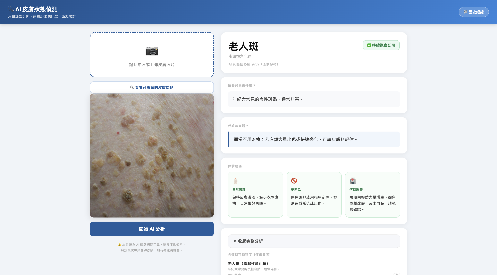
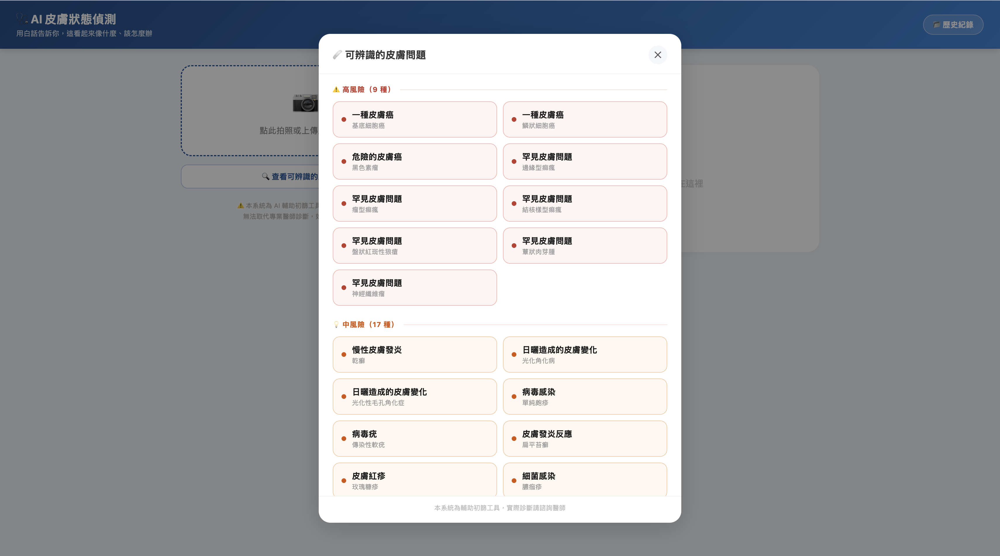

# 🩺 AI 皮膚狀態偵測 (Skin)

### 用 AI 看懂你的皮膚，用白話文說給你聽

以 AI 影像辨識初步判斷皮膚狀況的 Flask Web 應用：上傳或拍攝皮膚照片後，系統會用白話文告訴你「這看起來像什麼」「嚴不嚴重」以及「該怎麼辦」，降低醫學名詞帶來的閱讀門檻。

`Python 3.10+` · `Flask` · `🤗 HuggingFace Transformers` · `PyTorch` · `MIT License`

> ⚠️ **重要提醒**
> 本專案僅供學習與 AI 輔助初篩參考，**無法取代專業醫師診斷**。若有疑慮、症狀惡化或高風險結果，請盡快就醫。

---

## 📸 系統畫面

| 分析結果頁面 | 可辨識項目清單 |
|:---:|:---:|
|  |  |
| 上傳照片後即時顯示白話病名、風險等級與保養建議 | 依高／中／低風險分組列出系統可辨識的皮膚問題 |

---

## ✨ 功能特色

| | |
|---|---|
| 🧠 **雙模型分析** | 同時使用皮膚癌相關病變模型與日常皮膚病模型，取信心分數較高者作為主要判斷結果 |
| 💬 **白話結果** | 將專業病名轉換為「一般的痣」「危險的皮膚癌」等易懂說法 |
| 📋 **四大重點資訊** | 這看起來像什麼、嚴重程度、我該怎麼辦、日常保養建議（護理／禁忌／何時就醫） |
| 🚦 **視覺化風險等級** | 紅／黃／綠色塊搭配明確建議（盡快就醫／近期確認／持續觀察） |
| 🔍 **完整分析明細** | 可展開查看兩個模型 Top-3 預測類別的機率與專業名稱 |
| 📚 **可辨識項目列表** | 內建「查看可辨識的皮膚問題」清單，依風險等級分組顯示 |
| 🕓 **本機歷史紀錄** | 分析結果（含縮圖、時間、風險等級、信心分數）儲存在瀏覽器 `localStorage`，最多保留 10 筆 |

---

## 🛠️ 技術棧

| 分類 | 技術 |
|------|------|
| 後端框架 | Python 3、Flask |
| AI / 機器學習 | Hugging Face `transformers`（`image-classification` pipeline）、PyTorch |
| 影像處理 | Pillow |
| 前端 | HTML / CSS / 原生 JavaScript（單一模板，無前端框架） |
| 資料儲存 | 無伺服器端資料庫；歷史紀錄以瀏覽器 `localStorage` 儲存 |

<details>
<summary>🤗 <b>使用的兩個 Hugging Face 預訓練模型（點擊展開）</b></summary>

| 用途 | 模型 |
|------|------|
| 皮膚癌／痣等病變 | [Anwarkh1/Skin_Cancer-Image_Classification](https://huggingface.co/Anwarkh1/Skin_Cancer-Image_Classification) |
| 日常皮膚病 | [Jayanth2002/dinov2-base-finetuned-SkinDisease](https://huggingface.co/Jayanth2002/dinov2-base-finetuned-SkinDisease) |

模型權重不納入 Git，**第一次執行 `app.py` 時會自動從 Hugging Face 下載**並快取於本機（Windows 預設路徑：`%USERPROFILE%\.cache\huggingface\hub`）。

</details>

---

## 🚀 安裝步驟

### 環境需求

- ✅ Python 3.10 以上（建議 3.12）
- 💾 約 2～4 GB 磁碟空間（用於下載模型）
- 🖥️ CPU 即可執行（程式內模型載入設定為 `device=-1`），不需要 GPU

### 1️⃣ Clone 專案

```bash
git clone https://github.com/HSULIYUN/skin.git
cd skin
```

### 2️⃣ 建立虛擬環境並安裝依賴（建議）

```bash
python -m venv venv
source venv/bin/activate   # Windows 請用 venv\Scripts\activate

pip install -r requirements.txt
```

### 3️⃣ 環境變數設定

目前程式碼（`app.py`）**未讀取任何環境變數**，也沒有 `.env` 範例檔；`.gitignore` 中雖預先排除了 `.env`，但目前尚無需要設定的變數即可直接執行。若未來新增需要密鑰或組態的功能，請在此補充對應的 `.env` 說明。

### 4️⃣ 啟動服務

```bash
python app.py
```

終端機出現 `模型載入完成！` 與 Flask 的啟動訊息即代表服務已就緒。首次啟動需下載兩個模型，可能需數分鐘，請耐心等候。

啟動後於瀏覽器開啟（依 `app.py` 中 `app.run(host='0.0.0.0', port=5001)` 設定）：

| 環境 | 網址 |
|------|------|
| 🏠 本機 | http://127.0.0.1:5001 |
| 📶 同一區域網路內其他裝置 | http://你的電腦IP:5001 |

---

## 📖 使用方式

1. 📸 開啟網頁後，點選左側「點此拍照或上傳皮膚照片」區塊，選擇或拍攝一張皮膚照片
2. ✅ 確認預覽圖無誤後，按下「開始 AI 分析」按鈕
3. ⏳ 等待數秒（AI 分析中）後，右側會顯示：
   - 白話病名 + 專業名稱
   - 風險等級色塊（⚠️ 建議盡快就醫 / 💡 建議近期就醫確認 / ✅ 持續觀察即可）
   - 「這看起來像什麼」「我該怎麼辦」說明
   - 日常護理／要避免／何時就醫三張保養建議卡
4. 🔬 點選「查看完整分析（醫療專業資訊）」可展開兩個模型 Top-3 類別的機率長條圖
5. 📚 點選左側「查看可辨識的皮膚問題」可瀏覽系統支援辨識的所有病症，依高／中／低風險分組
6. 🕓 點選右上角「歷史紀錄」可查看先前分析過的紀錄（儲存在瀏覽器本機），或一鍵清除全部紀錄

---

## 📂 專案結構

```
skin/
├── app.py                  # Flask 後端：載入雙模型、標籤對照表、/predict 與 /supported API
├── templates/
│   └── index.html          # 前端頁面：上傳介面、結果呈現、歷史紀錄與可辨識清單彈窗
├── docs/
│   ├── 協作指南.md          # 分支開發、Pull Request 送審流程（給協作者）
│   └── 管理員設定.md        # main 分支保護設定、PR 審核流程（給管理員）
├── requirements.txt         # Python 依賴套件
├── .gitignore
├── LICENSE
└── README.md
```

---

## 🔌 API 說明

### `GET /`

回傳主頁面（`templates/index.html`）。

### `POST /predict`

上傳圖片並取得 AI 分析結果。

- **請求**：`multipart/form-data`，欄位名稱 `image`（圖片檔案）

<details>
<summary>📄 <b>回應範例（點擊展開）</b></summary>

```json
{
  "name": "黑色素細胞痣",
  "simple_name": "一般的痣",
  "description": "皮膚上常見的痣，通常無害。",
  "severity_text": "✅ 持續觀察即可",
  "severity_level": "low",
  "action": "先觀察即可；若變大、變色、出血或形狀不規則，請到皮膚科檢查。",
  "care": "每天塗抹 SPF 30+ 防曬乳，避免紫外線刺激；定期自我觀察痣的形狀與顏色變化。",
  "avoid": "避免過度摩擦或抓傷痣；避免長時間直接曝曬強烈陽光。",
  "see_doctor": "痣的邊緣不規則、顏色不均、直徑超過 6 mm，或出血、快速變大時，請就醫。",
  "confidence": 87.3,
  "source": "cancer_model",
  "all_predictions": [
    { "simple_name": "一般的痣", "name": "黑色素細胞痣", "description": "...", "prob": 87.3 }
  ]
}
```

</details>

### `GET /supported`

回傳系統可辨識的所有病症清單，依風險等級（`high` / `medium` / `low`）分組。

<details>
<summary>📄 <b>回應範例（點擊展開）</b></summary>

```json
{
  "high": [{ "simple_name": "危險的皮膚癌", "name": "黑色素瘤" }],
  "medium": [...],
  "low": [...]
}
```

</details>

---

## ☁️ 部署方式

> 🚧 **TODO**：目前僅提供本機開發模式啟動（`app.run(debug=True, ...)`），尚無正式的生產環境部署設定（如 WSGI Server、Docker、CI/CD）。

---

## 🤝 團隊協作

本專案採 **分支 → Pull Request → 管理員審核** 後才合併 `main`，請勿直接 push 到 `main`。

| 角色 | 文件 |
|------|------|
| 👤 協作者流程 | [docs/協作指南.md](docs/協作指南.md) |
| 🛡️ 管理員設定 | [docs/管理員設定.md](docs/管理員設定.md) |

---

## ❓ 常見問題

<details>
<summary><b>Q：模型檔案在哪裡？為什麼 repo 裡沒有？</b></summary>
<br>
A：權重檔體積大，不納入 Git。執行 `app.py` 時會自動從 Hugging Face 下載到本機快取。
</details>

<details>
<summary><b>Q：可以離線使用嗎？</b></summary>
<br>
A：模型下載完成後，在無需重新下載的情況下可離線推論；首次仍需網路。
</details>

<details>
<summary><b>Q：準確度如何？</b></summary>
<br>
A：屬輔助初篩工具，受拍攝光線、角度、畫質影響。請以醫師診斷為準。
</details>

---

## 📜 授權 (License)

本專案 repository 內含 [LICENSE](LICENSE) 檔案（MIT License）。所使用的 Hugging Face 預訓練模型，其授權條款請另參考各模型頁面說明。

## ⚕️ 免責聲明

本系統輸出結果不構成醫療建議、診斷或治療方案。開發者與貢獻者不對因使用本工具所產生的任何後果負責。如有健康疑慮，請諮詢合格醫療人員。

---

*Made with 🧠 + 🩹 by the Skin AI team*
